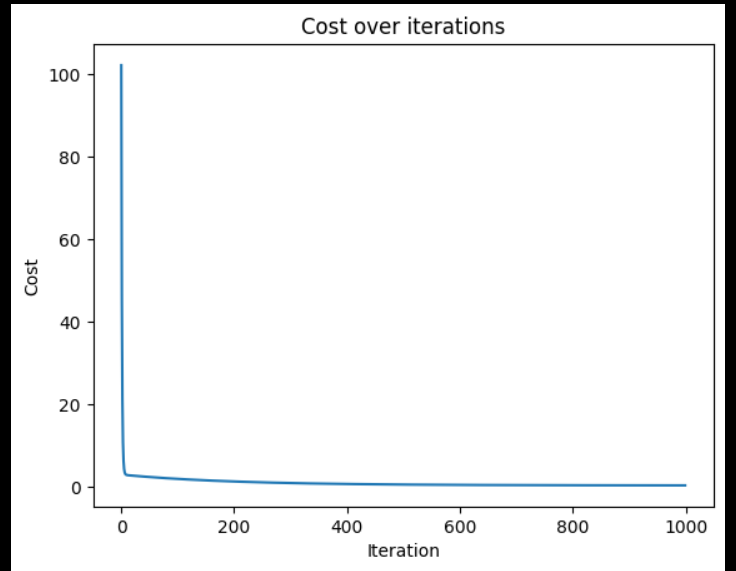
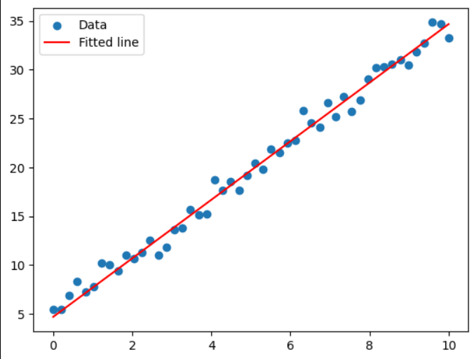

# Linear Regression from Scratch

This implements univariate linear regression from scratch using NumPy, built without the use of any ML libraries. Built by following Andrew Ng's Machine Learning Specialisation to understand the mechanics behind the algorithm.

## What this does

The model learns the best fit line of f(x)= wx+b by:

1. Starting with random intial weights and biases(w,b)
2. Computes a mean squared error between predictions and actual values(cost function)
3. Computes the gradients for w and b
4. Updates w and b to reduce the cost function
5. Repeats until cost is minimum (converges)

## The Math
1. Model: f(x)= wx+b
2. Cost function:J(w,b) = (1/2m) Σ (f(xᵢ) - yᵢ)²
3. Gradients: ∂J/∂w = (1/m) Σ (f(xᵢ) - yᵢ)*xᵢ and ∂J/∂b = (1/m) Σ (f(xᵢ) - yᵢ)
4. Gradient Descent: w := w - α · ∂J/∂w and b := b - α · ∂J/∂b where α is the learning rate

## Dataset
A synthetic dataset generated from a known linear relationship (y = 3x + 5) with added noise, so that the answer is known in advance and can be verified. The noise is added so that all datapoints dont end up on the line.

## Results
Cost over iterations plot:shows the cost dropping sharply in early iterations, then flattening as the model converges:

Fitted line against the data plot: the learned line closely tracks the underlying trend despite the noise:

Final learned parameters converge close to the true values: w=2.9963, b=4.7016(true values: w=3 and b=5), confirming the implementation is correct

## Reason to build from scratch

To understand the mechanics and hand derive the gradients instead of using ML libraries that use autodiff. Helps build understanding of how gradient descent is computed.

## Tech used
1. Python
2. NumPy
3. Matplotlib 
